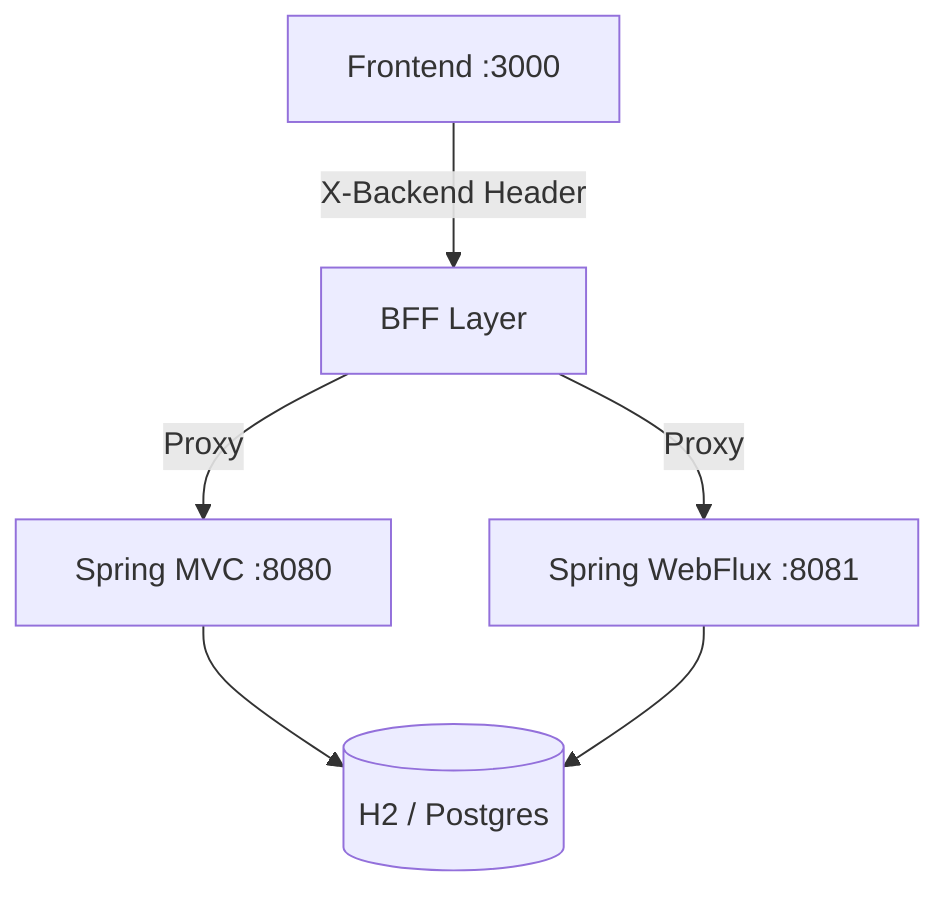

# Allica Bank - Technical Test

This repository contains a high-performance, full-stack implementation for a modern Customer Management system. It is designed to demonstrate **Senior+ level architectural decisions**, featuring a dual-backend approach (Spring Boot MVC & WebFlux) and a modern React frontend.

## 📋 Project Overview

The core objective of this Technical Test is to showcase flexibility and scalability. By providing two identical API implementations on different runtimes, the project demonstrates proficiency in both traditional blocking and reactive non-blocking paradigms.

- **Frontend**: High-performance React 18 application using **Rspack** for ultra-fast builds.
- **Backend (MVC)**: Traditional Spring Boot with Hibernate Search 7 (Lucene) for full-text search.
- **Backend (WebFlux)**: Reactive Spring Boot using R2DBC for high-throughput streaming events.

---

## 🚀 Quick Start (3 Minutes)

Run the automated setup script to configure the environment, install dependencies, and prepare the in-memory database:

```bash
chmod +x setup.sh start.sh
./setup.sh
```

### Starting the Application

Launch both backends and the frontend concurrently with a single command:

```bash
./start.sh
```

Once started:

- **Frontend**: [http://localhost:3000](http://localhost:3000)
- **Spring MVC Backend**: [http://localhost:8080](http://localhost:8080/actuator/health)
- **Spring WebFlux Backend**: [http://localhost:8081](http://localhost:8081/actuator/health)

> [!TIP]
> Use the **"Sign in (dev mode)"** button on the frontend to automatically bypass authentication. You can toggle between backends live in the application header.

---

## 🏗️ Implementation Detail Overview

The application follows a **BFF (Backend for Frontend)** pattern to manage authentication and backend switching seamlessly.



### Key Technical Pillars

- **Dual Runtime**: One API, two engines. Switchable at runtime with zero client changes.
- **Enterprise Search**: Lucene-powered full-text search integrated via Hibernate Search.
- **Strict Quality Gates**: 80%+ test coverage, mutation testing, and static analysis (PMD, Checkstyle).
- **Security First**: JWT RS256, OWASP security headers, and method-level access control.

For a deep dive into the architecture, design patterns, and technical justifications, please refer to:
👉 **[TECHNICAL_DETAILS.md](./TECHNICAL_DETAILS.md)**

---

## 🧪 Testing

To ensure everything is working correctly, you can run the following test suites:

### Backend Tests (Java/JUnit)

Runs all unit and integration tests (MVC, WebFlux, and Shared):

```bash
./gradlew test
```

### Frontend Tests (Jest/React)

Runs the React test suite with MSW network interception:

```bash
cd frontend && npm test
```

### Quality & Security Scans

```bash
./gradlew check            # Checkstyle, PMD, SpotBugs, JaCoCo
./gradlew dependencyCheckAnalyze  # OWASP CVE Scan
```

---

## 📝 Documentation

- **[TECHNICAL_DETAILS.md](./TECHNICAL_DETAILS.md)**: Side-by-side comparison, design decisions, and architectural deep-dive.
- **[AI_USAGE.md](./AI_USAGE.md)**: Detailed documentation of AI collaboration and human-in-the-loop decisions.

---
